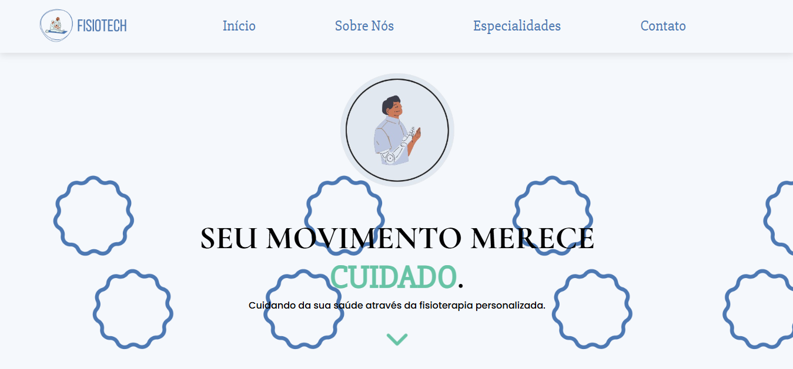

# 🩺 Fisiotech - Clínica de Fisioterapia

Landing page desenvolvida para uma clínica fictícia de fisioterapia, com foco na união entre tecnologia, inovação e cuidado humano.
O projeto apresenta uma página institucional com informações sobre a clínica, especialidades oferecidas e um formulário de contato para agendamento.

---

## 🚀 Funcionalidades

- ✅ Página inicial com apresentação da clínica
- ✅ Apresentação das especialidades
- ✅ Menu de navegação
- ✅ Página de contato
- ✅ Layout responsivo
- ✅ Ícones e fontes personalizadas

---

## 📸 Preview



---

## 🌐 Demonstração

Acesse o projeto online:

🔗 [FisioTech - Clínica de Fisioterapia](https://sofiapereiraa.github.io/FISIOTECH/)

---
## 💻 Como executar

1. Clone o repositório:

```bash
git clone URL_DO_REPOSITORIO
```

2. Abra o arquivo `index.html` no navegador.
