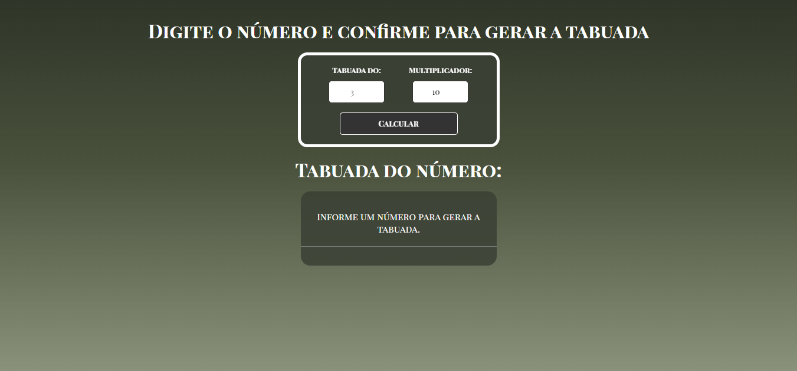

## 🔢 Tabuada

Projeto que gera a tabuada de um número informado pelo usuário.

### 🚀 Funcionalidades:
- Entrada de um número
- Geração da tabuada completa
- Exibição dinâmica na tela

### 🛠 Tecnologias:
- HTML
- CSS
- JavaScript

## 📸 Preview

---
